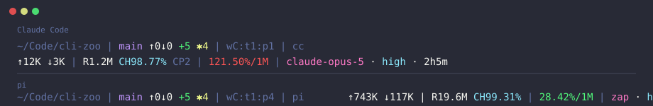

# cli-zoo

[](./LICENSE)
[](https://github.com/Spoon94/cli-zoo)
[](#)
[](#贡献)

> 个人收藏并整理的命令行小工具集合，按工具拆分目录组织，开箱即用。

每个工具存放在 [`zoo-scripts/<动物名>`](./zoo-scripts) 下（单脚本或多文件目录均可，入口可直接执行），通过仓库根目录的 `cli-zoo-install.sh` 软链到 `$PREFIX`（默认 `/usr/local/bin`）即可全局使用。

## 目录

- [快速开始](#快速开始)
- [工具列表](#工具列表)
  - [otter](#otter)
  - [wren](#wren)
- [安装与卸载](#安装与卸载)
- [贡献](#贡献)
- [License](#license)

## 快速开始

以安装 `otter` 为例：

```bash
# 1. 克隆本仓库
git clone https://github.com/Spoon94/cli-zoo.git
cd cli-zoo

# 2. 安装 otter 到 /usr/local/bin（可能需要 sudo）
./cli-zoo-install.sh otter

# 3. 验证
otter -h
```

不想动 `/usr/local/bin` 时，可用 `PREFIX` 指定任意可写目录：

```bash
PREFIX=$HOME/bin ./cli-zoo-install.sh otter
```

## 工具列表

### [otter](./zoo-scripts/otter)

用 tmux 把 AI CLI 工具、文件管理器、编辑器、git 客户端组合成一套开箱即用的开发会话布局，一条命令进入工作状态。

```bash
otter -c <tool> [-s <session>]   # 启动或复用一个 session
otter -ks <session>              # 杀掉指定 session
otter -h                         # 帮助
```

`-c` 可选值（白名单 `ALLOWED_TOOLS`）：`claude`、`qodercli`、`opencode`。布局为左 CLI 工具 + 右上 yazi + 右下空 shell，检测到 `nvim` / `lazygit` 时各开一个 window；软依赖缺失自动降级。


### [wren](./zoo-scripts/wren)

把两行 statusline（Dracula 配色）装到 Claude Code 与 pi 两个宿主上的安装器。装的是文件副本，装完不依赖本仓库还在原处。另带 Qoder CLI 的同构 payload（`wren-qc.py`），暂未进安装器、手动接线（见下）。

```bash
./cli-zoo-install.sh wren        # 先把 wren 装到 $PREFIX
wren install [cc|pi|all]         # 装到宿主（默认 all；幂等；cc 的别名 claude）
wren uninstall [cc|pi|all]       # 卸载（默认 all）
wren -h                          # 帮助
# qc（Qoder CLI）暂未进安装器，手动接线：
cp zoo-scripts/wren/wren-qc.py ~/.qoder/wren-qc.py && chmod +x ~/.qoder/wren-qc.py
# 再把 ~/.qoder/settings.json 的 statusLine 写成 {"type":"command","command":"<绝对路径>"}（只动该键）
```



```
~/Code/cli-zoo | main ↑0↓0 +4 ✱2 | wC:t1:p1 | cc
↑12K ↓3K | R1.2M CH57.14% CP2 | 8.40%/200K | claude-opus-5 · high · 1h5m
```

qc 侧同构，仅数据源不同（真会话实测样例）：

```
~/Code/cli-zoo | feat/x ↑0↓0 | wW:t1:p2 | qc
↑4.5M ↓65K | R4.2M CH98.21% | 15.00%/1M | Qwen3.8-Max · xhigh · 16m
```

行 1 = cwd + git + herdr 位置 + 宿主徽标；行 2 = 累计 token + 缓存（读取量 / `CH` 命中率 / `CP` 压缩次数）+ 上下文占用 + 模型 · 思考 · 时长。长路径长分支自动折叠不溢出。装完在 pi 里用 `/footer` 切换。

三宿主差异（cc / pi / qc）、安装器细节、`wren.ts` 相对 pi 上游的有意修改、Dracula 色板，见 [zoo-scripts/wren/README.md](./zoo-scripts/wren/README.md)；测试见 [docs/testing.md](./docs/testing.md)。

## 安装与卸载

```bash
./cli-zoo-install.sh <tool>     # <tool> 可选值：otter、wren
./cli-zoo-uninstall.sh <tool>   # 幂等：目标不存在时直接成功 exit 0
```

| 环境变量 | 默认值 | 说明 |
|----------|--------|------|
| `PREFIX` | `/usr/local/bin` | 软链目标目录。目录不存在时会自动 `mkdir -p`。 |

安装时检查源脚本存在且可执行（必要时 `chmod +x`），目标位置已有文件或软链则先 `rm -f`，再 `ln -s <repo>/zoo-scripts/<tool> $PREFIX/<tool>`（wren 因是多文件工具，软链的是目录内的入口脚本 `zoo-scripts/wren/wren`）。写入失败（权限不足）时会提示用 `sudo PREFIX=$PREFIX ./cli-zoo-install.sh <tool>` 重试。

> **wren 的两级安装是刻意的**：`cli-zoo-install.sh` 装的 `$PREFIX/wren` 是**软链**（跟随仓库，改脚本即时生效）；
> 而 `wren install` 装到两个宿主的 `$PREFIX/wren-cc` / `$PI_EXT_DIR/wren.ts` 是**文件副本**（仓库被移走/删除后 statusline 照常工作，更新需重跑 `wren install`）。

**wren 卸载要先拆线再卸本体**，否则会留下 `$PREFIX/wren-cc`、`settings.json` 里的 `statusLine`、以及 pi 扩展目录里的 `wren.ts`：

```bash
wren uninstall              # 拆掉两个宿主的接线
./cli-zoo-uninstall.sh wren # 再摘掉 wren 本体
```

## 贡献

欢迎 PR 和 Issue：

- 新增工具：把脚本放到 `zoo-scripts/`，在本 README「工具列表」中追加一节，并配套补齐 `cli-zoo-install.sh` / `cli-zoo-uninstall.sh` 的 `case` 分支与测试用例（见 [docs/testing.md](./docs/testing.md)）。
- 修复/改进现有工具：建议先在 Issue 中讨论后再提 PR。
- 提交规范：建议遵循 [Conventional Commits](https://www.conventionalcommits.org/)。

## License

[MIT](./LICENSE)
